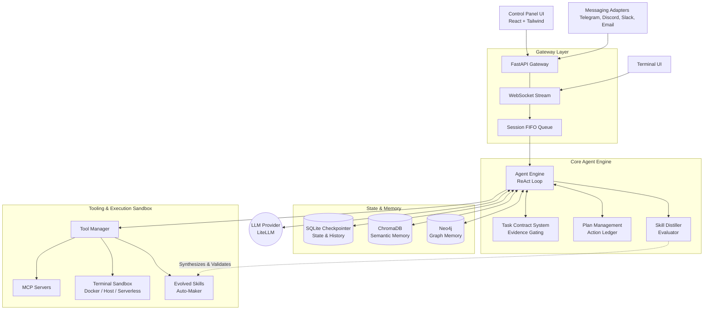

# Agent AI Architecture

Here is the high-level architecture diagram for the Agent AI framework. It visualizes the flow of data from external interfaces (UI, Adapters), through the asynchronous FastAPI gateway, and into the core ReAct Agent loop, which coordinates with memory stores, tooling, and execution sandboxes.

