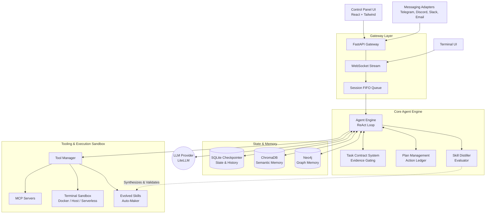

<p align="center">
  
</p>

A production-grade ReAct agent built for reliability. Features **task-contract execution** to prevent hallucination, **skill distillation** to evolve its own tools, **hybrid memory**, and a real-time streaming control panel.

### Distill TUI

Launch the interactive terminal interface with:

```bash
distill
# or
distill tui
```


## Architecture



### Directory Structure

```text
src/
  agent.py          -- ReAct loop, session management, checkpointing
  contract.py       -- Task-contract system (evidence tracking)
  evaluator.py      -- Skill distiller: trajectory -> reusable MCP skill
  memory.py         -- HybridMemory: ChromaDB (semantic) + Neo4j (graph)
  gateway.py        -- FastAPI app, WebSocket stream, session-per-FIFO-lane
  tools.py          -- MCP servers, terminal, file, process, port tools
control-panel/      -- React + Tailwind chat UI with live token streaming
```

## 🌟 Key Features

* **Task-Contract Execution**: The agent must declare the required execution evidence (files created, services running) before starting a task. The final response is gated on this physical evidence, eliminating "I'll do it now" hallucinations.
* **Skill Distillation**: After a successful complex task, an LLM evaluates the trajectory and synthesizes a parameterized Python tool. New skills are versioned, validated, and automatically rolled back if their success rate drops.
* **Session-per-FIFO-Lane Concurrency**: Every user session gets a dedicated queue and worker task, allowing high concurrency with strict message ordering.
* **Hybrid Memory**: Combines SQLite full-text search, ChromaDB semantic embeddings, and Neo4j graph relationships to recall cross-session context.
* **Universal Sandboxing**: Run shell operations locally, in Docker, or via serverless platforms (Daytona, E2B, Modal).
* **Shareable Skills**: Export and import distilled skills via the open `SKILL.md` format.

## 🚀 Quick Start

The fastest way to run Distill locally is using Docker Compose:

```bash
# 1. Copy the environment template
cp an-api.env.example an-api.env

# 2. Add your LLM API Key to an-api.env (e.g., MOONSHOT_API_KEY or OPENAI_API_KEY)
# By default, Distill uses LiteLLM and supports OpenAI, Anthropic, Gemini, Ollama, etc.

# 3. Start the application
docker compose up -d --build
```

* **Control Panel (UI)**: `http://localhost:5173`
* **API / Docs**: `http://localhost:8000/docs`

### CLI Installation

#### Empty machine (no Node, no Python)?

The bootstrap scripts install the prerequisites for you, then hand off to the
interactive installer. They are the recommended path on a fresh PC.

**Windows (PowerShell):**
```powershell
irm https://raw.githubusercontent.com/Aspct3434/agent-ai/master/scripts/bootstrap.ps1 | iex
```

**macOS / Linux (bash):**
```bash
curl -fsSL https://raw.githubusercontent.com/Aspct3434/agent-ai/master/scripts/bootstrap.sh | bash
```

You can also clone the repo first and run `scripts/bootstrap.ps1` (Windows) or
`scripts/bootstrap.sh` (macOS/Linux) directly.

#### Already have Node?

Run the interactive installer with `npx` (no global install required):

```powershell
npx @aspct3434/distill-agent install
```

Prefer pinning to the exact GitHub revision? Use the repo form:

```bash
npx --yes github:Aspct3434/agent-ai install
```

After installation, use the CLI to manage the agent:
```bash
npm i -g @aspct3434/distill-agent
distill                           # Open the interactive terminal UI
distill start                     # Start the backend and control panel
distill logs                      # View running logs
distill update                    # Pull the latest changes
distill doctor                    # Diagnose the install and environment

# npx works too if you prefer not to install globally:
npx @aspct3434/distill-agent start    # Start the backend and control panel
npx @aspct3434/distill-agent logs     # View running logs
npx @aspct3434/distill-agent update   # Pull the latest changes
npx @aspct3434/distill-agent doctor   # Diagnose the install and environment
```

## ⚙️ Configuration

Distill is highly configurable via environment variables. Key settings in `an-api.env`:

| Variable | Default | Description |
|---|---|---|
| `AGENT_MODEL` | `moonshot/kimi-k2.5` | The primary LLM to use (supports any LiteLLM provider string). |
| `AGENT_SANDBOX` | (blank) | Leave blank for Docker Compose. Set to `docker` to run Docker-in-Docker, or `http` for serverless. |
| `AGENT_REQUIRE_APPROVAL`| `off` | Set to `risky` or `all` to require human-in-the-loop approval before executing shell commands. |
| `AGENT_API_TOKEN` | required | Bearer token for API/WebSocket access; agent endpoints return 503 until set. |
| `AGENT_ALLOW_INSECURE_NO_AUTH` | `false` | Explicit local-only override for running without API auth. |
| `GATEWAY_RATE_LIMIT_RPM` | `60` | Per-client request limit, keyed by API token or client IP. |
| `AGENT_LOG_DB_PATH` | `./data/gateway_logs.db` | Persistent SQLite log store used by `/api/logs`. |

## 🔌 Integrations & Adapters

Distill can operate directly in your favorite platforms. Adapters are disabled by default and activate when you provide a bot token in `an-api.env`:
* **Telegram**: Set `TELEGRAM_BOT_TOKEN`. Supports voice note transcriptions via Whisper.
* **Discord**: Set `DISCORD_BOT_TOKEN`.
* **Slack**: Set `SLACK_BOT_TOKEN` & `SLACK_APP_TOKEN` (Socket Mode).
* **Email**: Set `EMAIL_ADDRESS`, `EMAIL_PASSWORD`, `EMAIL_IMAP_HOST`, `EMAIL_SMTP_HOST`.

Each channel provides a live typing indicator, streams real-time tool execution logs, and isolates conversations.

## 🧪 Testing

Distill maintains a robust test suite covering contracts, planners, adapters, and the ReAct loop:

```bash
pytest                        # Run the full suite
pytest tests/test_task_contract_loop.py -v   # Test the anti-hallucination contract system
```
